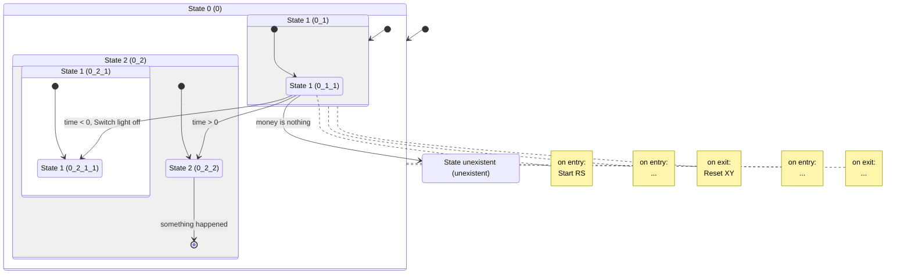

```mermaid
stateDiagram-v2
    0: State 0 (0)
    state 0 {
        0_1: State 1 (0_1)
        state 0_1 {
            0_1_1: State 1 (0_1_1)
            state 0_1_1
            note right of 0_1_1
               on entry:
               Start RS
            end note
            [*] --> 0_1_1
        }
        note right of 0_1
           on entry:
           ...
        end note
        note right of 0_1
           on exit:
           Reset XY
        end note

        0_2: State 2 (0_2)
        state 0_2 {
            0_2_1: State 1 (0_2_1)
            state 0_2_1 {
                0_2_1_1: State 1 (0_2_1_1)
                state 0_2_1_1
                [*] --> 0_2_1_1
            }

            0_2_2: State 2 (0_2_2)
            state 0_2_2
            0_2_2 --> [*]: something happened
            [*] --> 0_2_2
        }
        [*] --> 0_1
    }
    note right of 0
       on entry:
       ...
    end note
    note right of 0
       on exit:
       ...
    end note

    unexistent: State unexistent (unexistent)
    state unexistent
    [*] --> 0

    %% Transitions
    0_1_1 --> 0_2_2: time > 0
    0_1_1 --> 0_2_1_1: time < 0, Switch light off
    0_1_1 --> unexistent: money is nothing
```
