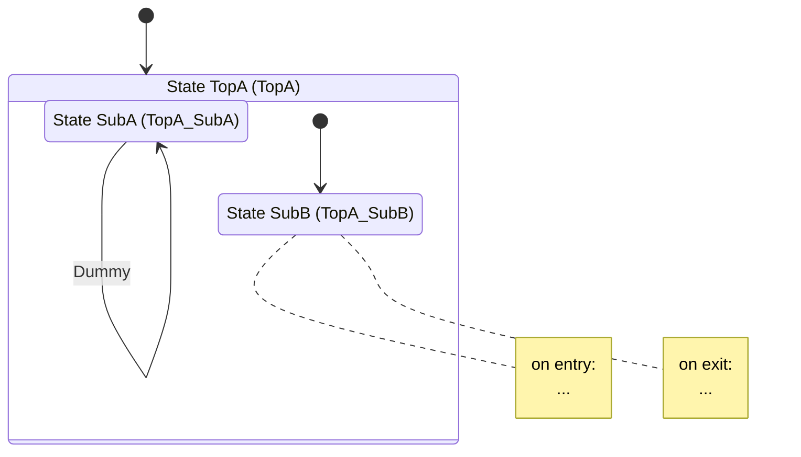

```mermaid
stateDiagram-v2
    TopA: State TopA (TopA)
    state TopA {
        TopA_SubA: State SubA (TopA_SubA)
        state TopA_SubA
        TopA_SubA --> TopA_SubA: Dummy

        TopA_SubB: State SubB (TopA_SubB)
        state TopA_SubB
        note right of TopA_SubB
           on entry:
           ...
        end note
        note right of TopA_SubB
           on exit:
           ...
        end note
        [*] --> TopA_SubB
    }
    [*] --> TopA

    %% Transitions
```
