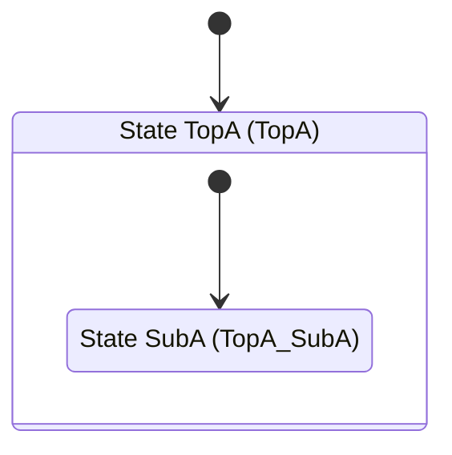

```mermaid
stateDiagram-v2
    TopA: State TopA (TopA)
    state TopA {
        TopA_SubA: State SubA (TopA_SubA)
        state TopA_SubA
        [*] --> TopA_SubA
    }
    [*] --> TopA

    %% Transitions
```
