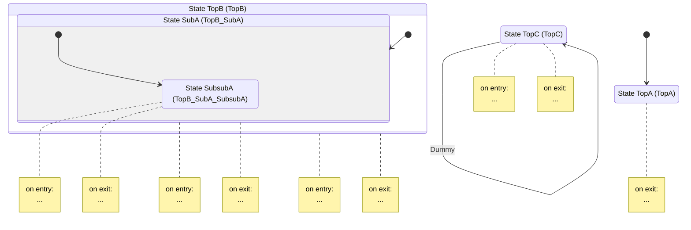

```mermaid
stateDiagram-v2
    TopA: State TopA (TopA)
    state TopA
    note right of TopA
       on exit:
       ...
    end note

    TopB: State TopB (TopB)
    state TopB {
        TopB_SubA: State SubA (TopB_SubA)
        state TopB_SubA {
            TopB_SubA_SubsubA: State SubsubA (TopB_SubA_SubsubA)
            state TopB_SubA_SubsubA
            note right of TopB_SubA_SubsubA
               on entry:
               ...
            end note
            note right of TopB_SubA_SubsubA
               on exit:
               ...
            end note
            [*] --> TopB_SubA_SubsubA
        }
        note right of TopB_SubA
           on entry:
           ...
        end note
        note right of TopB_SubA
           on exit:
           ...
        end note
        [*] --> TopB_SubA
    }
    note right of TopB
       on entry:
       ...
    end note
    note right of TopB
       on exit:
       ...
    end note

    TopC: State TopC (TopC)
    state TopC
    TopC --> TopC: Dummy
    note right of TopC
       on entry:
       ...
    end note
    note right of TopC
       on exit:
       ...
    end note
    [*] --> TopA

    %% Transitions
```
